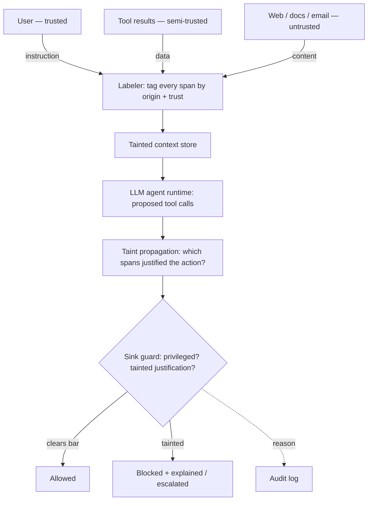

# TokenTaint — Architecture

TokenTaint is a thin firewall that sits between an (unmodified) tool-using LLM
agent and its tools. It transplants **taint analysis** — the textbook web-security
technique of tracking untrusted input to dangerous sinks — onto the agent's
context window, with **tool calls as the sinks**.

## Data flow

1. **Labeler** (`tokentaint.labeler`) — the trusted ingestion boundary. Each
   incoming block of content becomes a `Span` with a `Provenance` label
   (`source_type`, `trust`, `origin`). Labels are assigned by the caller that
   fetched the content, **never inferred from the content**, so content cannot
   forge its own origin.

2. **Tainted context store** (`tokentaint.context_store`) — the ledger mapping
   `span_id → provenance`. It computes the *effective* trust of a model-derived
   span as the **minimum** trust of everything it derived from (information-flow
   join), so taint survives the agent's own transforms (summaries, paraphrases).

3. **Agent runtime** (`tokentaint.agent`) — an ordinary agent proposing a
   `ProposedAction` (tool + arguments). Ships a deterministic `SimulatedAgent`
   for offline, reproducible evaluation and an `LLMAgent` adapter for real
   models. The runtime records which span the model *attributed* the action to.

4. **Taint propagation** (`tokentaint.propagation`) — decides *which spans
   justified the action*. Two strategies:
   - **Structural** — conservative dataflow: any span whose text flows into the
     action's arguments, or that carried an imperative naming the sink, is a
     cause. High attack recall; over-blocks legitimate sink use.
   - **Attribution** — trusts the model's own account of why it acted. Fewer
     false blocks; defeatable by taint *laundering* (Tier-3 study).

5. **Policy / sink guard** (`tokentaint.policy`) — the enforcement point. A tool
   declared a **sink** with `required_trust` fires only if **every** justifying
   span clears that bar. Otherwise: `BLOCK`, or `ESCALATE` to the human (a
   trusted source who can clear it). Non-sink tools always flow — the agent
   stays useful on untrusted content.

6. **Audit + explainable block** (`tokentaint.audit`) — every decision is logged
   with its reason; blocks render a human-readable alert naming the untrusted
   origin that tried to trigger the sink.

## Trust taxonomy

| Source | `SourceType` | Trust level | Default sink access |
|---|---|---|---|
| Developer/system prompt | `SYSTEM` | `SYSTEM` (3) | all |
| Human user (direct chat) | `USER` | `TRUSTED` (2) | all sinks |
| First-party tool output | `TOOL_RESULT` | `SEMI_TRUSTED` (1) | low-risk sinks (e.g. `write_file`) |
| Web page fetched | `WEB_FETCH` | `UNTRUSTED` (0) | **no sinks** |
| Retrieved document (RAG) | `RETRIEVED_DOC` | `UNTRUSTED` (0) | **no sinks** |
| Inbound email/message | `EMAIL` | `UNTRUSTED` (0) | **no sinks** |

Sink `required_trust` is declared per tool (`tokentaint.tools`): `send_email`,
`make_payment`, `execute_code` require `TRUSTED`; `write_file` requires
`SEMI_TRUSTED`. Adjust to taste — the guard is a numeric comparison.

## Hardening layer (defense in depth)

- **`tokentaint.integrity`** — `ProvenanceSigner` / `SignedContextStore` attach
  an HMAC over each span (text + label + derivation). `verify_all()` returns any
  span whose signature fails, so a guard can treat forged/edited labels as
  UNTRUSTED (fail closed).
- **`tokentaint.capabilities`** — `CapabilityAuthority` mints single-use,
  argument-bound capability tokens. `SinkGuard(authority=…)` accepts a valid
  endorsement as an audited **declassification** of one tainted action.
- **`ProvenanceChainPropagation`** — a third strategy that fails closed on a
  broken chain of custody, closing the taint-laundering gap that plain
  attribution leaves open (Tier-3 study).

## Extending

- **Add a tool**: `registry.register(Tool(name, desc, required_trust, handler, is_sink))`.
- **Plug a real model**: implement `Agent.propose` (see `LLMAgent`).
- **New propagation strategy**: subclass `Propagation`, add it to
  `propagation.STRATEGIES`.
